[ 🇺🇸 English ] | [ 🇨🇱 [Leer en Español](README.md) ]

# EVALUATING YOLOV8 EFFICIENCY ON GPU, CPU AND RASPBERRY PI: STANDARD VS. SEPARABLE CONVOLUTIONS

> **Author:** Pablo Vicente Reyes Pino
> **Programme:** Data Science
> **Advisor:** Dr. Anthony D. Cho · **Reviewer:** Carlos Muñoz
> **Institution:** School of Engineering — Faculty of Sciences, Engineering and Technology, Universidad Mayor (Santiago, Chile)
> **Thesis document:** April 2026 · **Defence:** 24 July 2026


Thesis project repository comparing **YOLOv8 with standard convolutions (Conv2D)** against **YOLOv8 with depthwise-separable convolutions (SeparableConv2D)** in the *Head* module, training both models on COCO2017 and measuring detection performance and inference cost on **GPU, CPU and Raspberry Pi 4**.

---

## Table of contents

1. [Introduction](#1-introduction)
2. [Objectives and hypothesis](#2-objectives-and-hypothesis)
3. [Theoretical framework](#3-theoretical-framework)
4. [Methodology](#4-methodology)
5. [Development and results](#5-development-and-results)
6. [Conclusions and future work](#6-conclusions-and-future-work)
7. [Repository structure](#7-repository-structure)
8. [Reproducing the experiment](#8-reproducing-the-experiment)
9. [References](#9-references)

---

## 1. INTRODUCTION

### 1.1 Motivation and rationale

Object detection identifies and localizes elements within an image. Combined with Deep Learning — and in particular with the **YOLO (*You Only Look Once*)** family — these systems reach a combination of accuracy and speed that enables automated real-time decision making: driver assistance and collision avoidance, surveillance, robotics, industrial inspection and traffic control.

The rationale rests on three points:

1. **Technological relevance of YOLOv8**, a widely adopted architecture offering a favourable balance between accuracy, efficiency, flexibility and ease of use.
2. **Use in real operating environments**, where detection quality and speed are hard requirements, and evaluating model performance is a necessary step before any deployment.
3. **Resource management**, since YOLOv8 is designed to reduce computational cost relative to other detectors, which favours its execution on constrained systems.

On that basis, the work proposes **modifying YOLOv8 by introducing separable convolutions in place of traditional 2D convolutions**, in order to analyse the impact on accuracy, inference speed and computational efficiency, and thereby determine the real feasibility of deployment on reduced hardware.

### 1.2 Problem statement

Despite advances in convolutional networks, the central problem for adopting object detection in real-world applications **is not limited to detection quality, but to the feasibility of execution in compute-constrained environments**.

The Deep Learning models normally used require high processing capacity, which makes deployment difficult on embedded platforms or low-power devices (a Raspberry Pi, for example), where available memory, CPU power and energy consumption are limited. An unavoidable trade-off follows: running complex models on reduced hardware **increases latency and compromises the operability of the system**, even when the model performs well on high-performance infrastructure.

This gap makes it hard to bring computer-vision solutions to low-cost, high-availability real environments. In that context arises the need to evaluate a modification of YOLOv8 based on separable convolutions, to analyse whether it is possible to **improve computational efficiency without significantly compromising detection capability**.

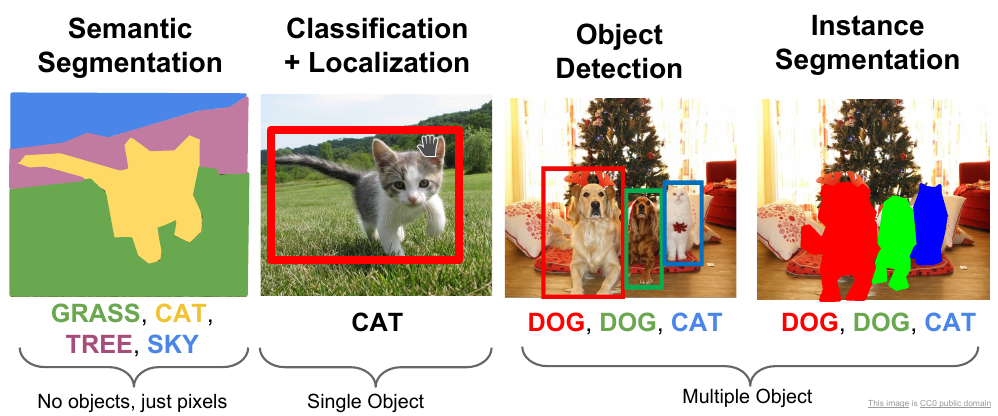

<p align="center"><em>Figure 1: Object detection example (YOLO). Places object detection within the family of computer-vision tasks: semantic segmentation, classification + localization, object detection and instance segmentation.</em></p>

### 1.3 Project scope

The study covered object-detection efficiency with YOLOv8 models across **two execution platforms** (a desktop computer and a Raspberry Pi 4) and **two architectural configurations** (standard Conv2D implementation and a modified implementation with separable convolutions). Evaluation used **COCO2017** as the reference, in a comparable and reproducible way.

**Out of scope:** advanced model optimization (quantization, *pruning*, accuracy-recovery *fine-tuning*) and implementations on other hardware environments.

---

## 2. OBJECTIVES AND HYPOTHESIS

### 2.1 General objective

> Analyse and evaluate the YOLOv8 object-detection model, deploying it in a hardware environment with reduced capabilities.

### 2.2 Specific objectives

- Analyse the architecture and the technical improvements introduced in YOLOv8.
- Develop both versions of the YOLOv8 model — the classic configuration and the modified one — enabling experimental analysis and evaluation.
- Evaluate model performance in terms of accuracy, speed and computational efficiency.
- Compare the performance of the two YOLOv8 versions on reduced hardware.

### 2.3 Research hypothesis

> Deep Learning models adapted for reduced hardware will achieve higher accuracy than traditional Deep Learning models as a function of the available resources, comparing specific performance metrics.

> [!NOTE]
> The results in Section 5 **do not confirm the hypothesis in terms of detection quality**: the separable variant does not beat the standard model on mAP, IoU, precision or recall. They do confirm it in terms of *efficiency as a function of available resources*, which is where the separable variant is clearly superior on hardware without acceleration. Section 6 develops this distinction.

---

## 3. THEORETICAL FRAMEWORK

### 3.1 From hand-crafted features to single-stage detectors

Object detection evolved from hand-crafted descriptors — **SIFT** (*Scale-Invariant Feature Transform*) and **HOG** (*Histogram of Oriented Gradients*) — towards Deep Learning models. Those methods captured local geometric traits and served as a basis for classification, but their rigidity under illumination changes, rotations and dynamic scenes drove the adoption of **convolutional neural networks (CNNs)**.

**AlexNet** (2012) demonstrated the effectiveness of CNNs by winning ImageNet, and was followed by **R-CNN**, **Fast R-CNN** and **Faster R-CNN**, which improved accuracy and efficiency through region proposals. In 2015, **YOLO** introduced single-pass detection over the image, subdividing it into a grid of predictive regions and achieving a balance between accuracy and speed. Later came **FPN** (*Feature Pyramid Networks*), **SSD** and *Transformer*-based architectures, supported by advances in GPUs and TPUs.

In parallel, the need to run detection on mobile and embedded devices gave rise to **depthwise-separable convolutions**, popularized by **MobileNet** and **Xception**, along with **parameter pruning** and **weight quantization** techniques.

| Model | Advantages | Limitations |
| :--- | :--- | :--- |
| **SIFT and HOG** | Effective for detecting basic objects, especially in scenarios where variability is limited and features are consistent. | Significant limitations under image and context variability; heavily dependent on manual feature extraction. |
| **AlexNet and CNNs** | CNNs, introduced by AlexNet in 2012, learn high-level representations directly from image data without hand-crafted features, giving greater accuracy and generalization. | Require large amounts of data and compute power to train efficiently; complexity and computational cost are high. |
| **R-CNN family** | Improved accuracy and efficiency by integrating region-proposal and classification stages. Faster R-CNN introduces a Region Proposal Network (RPN) that generates proposals efficiently. | Architectural complexity that increases training time and computational demand; requires multiple detection stages. |
| **YOLO** | Changed the paradigm by detecting in a single pass, enabling real time; YOLOv3 and later improved accuracy and efficiency with advanced techniques such as separable convolutions and feature pyramid networks. | Difficulties detecting small objects precisely and in scenarios with many classes; trades some accuracy for speed. |
| **SSD and FPN** | SSD detects across multiple scales and aspect ratios in one pass; FPN uses a feature-pyramid architecture for objects of different sizes and resolutions. | Lower accuracy than more advanced models in certain scenarios; may not handle scale variation as efficiently as others. |
| **Transformers (DETR)** | Handle spatial and contextual relationships in complex images better, showing significant accuracy and efficiency gains. | Relatively new in computer vision, with optimization and adoption challenges; model complexity hinders training and deployment. |

<p align="center"><em>Table 2.1: Comparison of object-detection models in terms of advantages and limitations.</em></p>

### 3.2 YOLOv8 architecture

YOLOv8 (2023) is a *single-stage* detector built on a deep convolutional network that predicts bounding boxes and classes in a single pass. Its architecture is organized in three blocks: **Backbone**, **Neck** and **Head**.

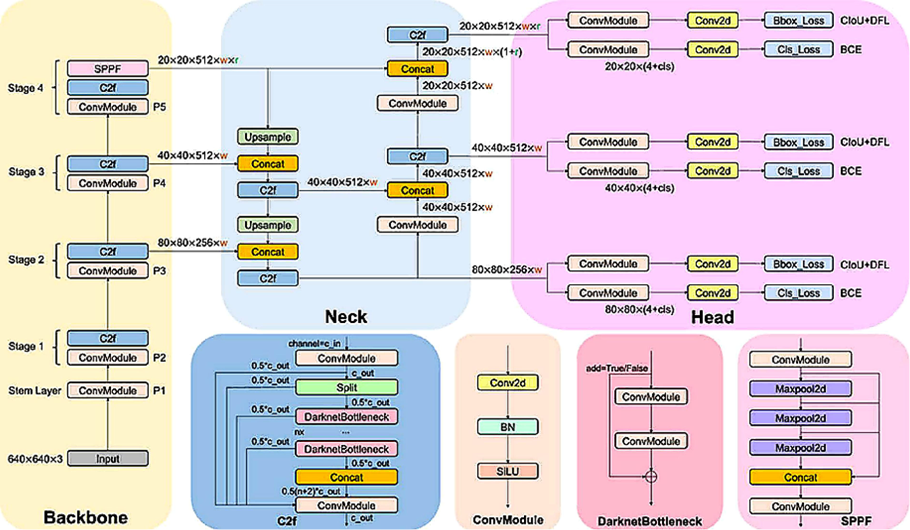

<p align="center"><em>Figure 2: Standard YOLOv8 model as implemented (Terven et al., 2023). 640×640×3 input, four Backbone stages, multi-scale fusion in the Neck and three decoupled prediction branches in the Head.</em></p>

#### Backbone

Extracts hierarchical features from the input image and produces high-level feature maps.

| Component | Function |
| :--- | :--- |
| **CSPDarknet** | Darknet variant that splits the network into two partial paths (*Cross Stage Partial*), reducing computational redundancy and improving feature learning. |
| **Convolutional layers (Conv2D)** | Apply filters over the input to detect edges, textures and patterns. |
| **Batch Normalization** | Normalizes the previous layer's output, stabilizing training. |

#### Activation function: SiLU

YOLOv8 uses **SiLU** (*Sigmoid Linear Unit*, also known as Swish), defined as:

$$\mathrm{SiLU}(x) = x \cdot \sigma(x)$$

where $\sigma(x)$ is the sigmoid function:

$$\sigma(x) = \frac{1}{1 + e^{-x}}$$

Its advantages over ReLU or Leaky ReLU:

- **Better gradient flow:** reduces the *vanishing gradient* problem in deep networks.
- **Greater expressiveness:** preserves useful negative values, allowing more complex relationships to be modelled.
- **Better performance on vision tasks:** improves detection and segmentation accuracy in models such as YOLOv8.
- **Continuity and smoothness:** introduces no discontinuity points, which stabilizes training.

#### Neck

Acts as the bridge between Backbone and Head, consolidating and refining the extracted features:

- **Feature fusion:** **FPN** (*Feature Pyramid Network*) and **PANet** (*Path Aggregation Network*) structures that combine multi-scale information, exploiting both low-level and high-level features.
- **Feature refinement:** specialized layers that discard irrelevant information before it reaches the Head.
- **Concatenation layers (Concat):** integrate maps from different network levels.
- **Upsampling:** reconstructs spatial information lost during convolution and pooling, via interpolation and *transposed convolutions*.

#### Head

Generates the final predictions — classes and box coordinates — from the features delivered by the Neck. **This is the module modified in this work.**

- **Decoupled strategy (*Decoupled Head*):** separates the classification branch from the box-regression branch, optimizing performance in complex scenarios.
- **Prediction at three hierarchical levels:**
  - `yolo_v8_head_1` — smaller objects (80×80).
  - `yolo_v8_head_2` — medium-sized objects (40×40).
  - `yolo_v8_head_3` — large objects (20×20).
- **Prediction maps per scale:**
  - *Classification map:* class probability for each cell of the output grid.
  - *Box regression map:* normalized coordinates $(x, y, w, h)$, where $(x,y)$ is the box centre and $(w,h)$ its width and height.
- **Non-Maximum Suppression (NMS):** filters redundant detections, keeping the highest-confidence ones and discarding those whose IoU with a higher-confidence prediction exceeds a predefined threshold.
- **Post-processing:** final output with adjusted coordinates, confidence scores and class labels.

#### Advanced components

| Module | Description |
| :--- | :--- |
| **Residual blocks** | Two 3×3 convolutions with padding 1, Batch Normalization, SiLU activation and a **residual connection** (element-wise addition between the block input and a later layer's output), mitigating vanishing gradients without increasing computational complexity. |
| **C2f (*Cross Stage Partial*)** | Introduces partial cross-stage connections and *shortcuts* that improve information propagation; combines 1×1 and 3×3 convolutions with batch normalization. |
| **ConvModule** | Basic block: 1×1 or 3×3 convolution → Batch Normalization → SiLU. Its modular design allows reuse throughout the network. |
| **DarknetBottleneck** | Residual-block variant adapted to Darknet, with convolutional layers and skip connections. |
| **SPPF (*Spatial Pyramid Pooling – Fast*)** | Captures multi-scale information by combining pooling windows of different sizes, integrating fine detail and large-scale dependencies at low cost. |

### 3.3 Conv2D vs. separable convolutions

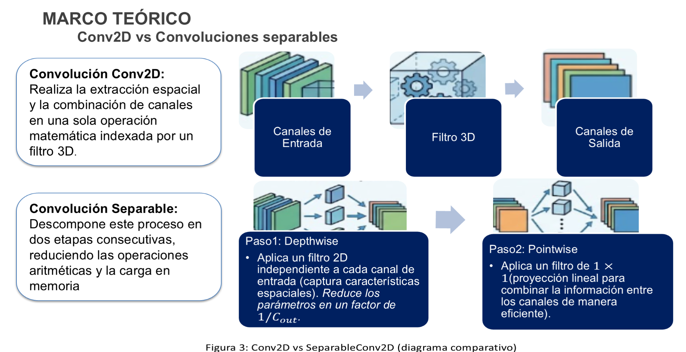

<p align="center"><em>Figure 3: Conv2D vs SeparableConv2D (comparative diagram).</em></p>

#### Standard convolution (Conv2D)

Performs spatial extraction and channel combination **in a single mathematical operation** indexed by a 3D filter. For a kernel of size $k \times k$, with $C_{in}$ input channels and $C_{out}$ output filters, the total parameter count is:

$$P_{\text{standard conv}} = k \times k \times C_{in} \times C_{out}$$

where:

- $k$ is the kernel size (e.g. $3\times3$ or $5\times5$), defining the spatial area over which filters are applied at each convolution step.
- $C_{in}$ is the number of input channels, i.e. the input depth (e.g. $C_{in}=3$ for an RGB image).
- $C_{out}$ is the number of filters used, which determines the number of output channels.

#### Step 1 — Depthwise convolution

Applies **one independent 2D filter per input channel**, capturing spatial patterns without mixing channels:

$$P_{\text{depthwise}} = k \times k \times C_{in}$$

The parameter count is reduced **by a factor of $1/C_{out}$** relative to the standard convolution. In exchange, because each channel is processed in isolation, depthwise convolution **on its own cannot learn cross-channel interactions**, which limits its representational capacity.

#### Step 2 — Pointwise convolution

To overcome that limitation, a $1\times1$ convolution is applied to the depthwise output — a **linear projection** that preserves the spatial resolution of the feature maps and combines information across channels:

$$P_{\text{pointwise}} = C_{in} \times C_{out}$$

#### Combined cost and reduction factor

The total cost of the separable convolution is the **sum** of both stages instead of the product:

$$P_{\text{separable}} = \underbrace{k^2 \cdot C_{in}}_{\text{depthwise}} + \underbrace{C_{in} \cdot C_{out}}_{\text{pointwise}}$$

giving a reduction factor of:

$$R = \frac{P_{\text{separable}}}{P_{\text{standard conv}}} = \frac{k^2 C_{in} + C_{in} C_{out}}{k^2 C_{in} C_{out}} = \frac{1}{C_{out}} + \frac{1}{k^2}$$

For a $3\times3$ kernel and large $C_{out}$, $R \approx 1/9$: the arithmetic cost grows **additively** with kernel size instead of multiplicatively.

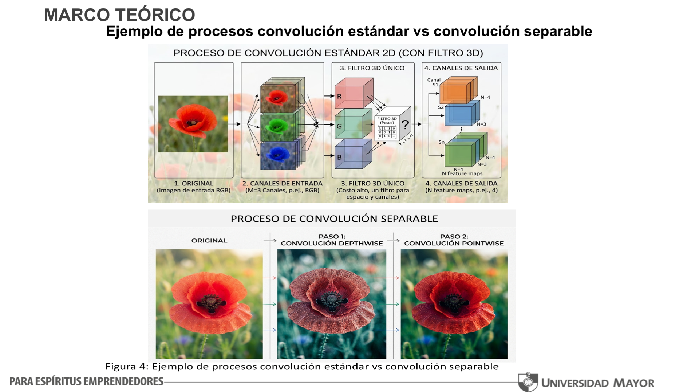

<p align="center"><em>Figure 4: Example of standard vs. separable convolution processes. Above, the single 3D filter sweeping space and channels simultaneously; below, the decomposition into per-channel filtering (depthwise) followed by cross-channel combination (pointwise).</em></p>

#### Advantages of separable convolutions

- **Fewer parameters:** standard convolutions apply an expensive 3D filter; separable ones decompose it into per-channel 2D filters plus a $1\times1$ combination, preserving feature-extraction capability with fewer parameters.
- **Computational efficiency:** fewer parameters mean fewer arithmetic operations during training and inference, yielding faster execution and lower memory and power usage.
- **Better performance on resource-limited devices:** reducing model complexity makes it possible to run deeper networks on platforms with constrained processing capacity.

> The base YOLOv8 architecture does **not** natively incorporate separable convolutions; their integration is an unofficial experimental variant, and it is exactly the adaptation this work implements and measures.

### 3.4 Choosing the embedded platform: Raspberry Pi 4 vs. ESP32-CAM

| Criterion | Raspberry Pi 4 | ESP32-CAM |
| :--- | :--- | :--- |
| **Processor** | Quad-core ARM Cortex-A72 @ 1.5 GHz | ESP32-D0WDQ6, 2 cores @ 240 MHz |
| **Memory** | 1 / 2 / 4 / 8 GB RAM | 520 KB RAM + 4 MB Flash |
| **Deep Learning compatibility** | Runs detection models; supports Intel Neural Compute Stick and Google Coral TPU | Basic image-recognition tasks |
| **Outcome during testing** | Ran YOLOv8 successfully | **The model could not be loaded into memory** |

During testing, YOLOv8 was attempted on the ESP32-CAM, but its RAM and processing limits prevented loading the model into device memory. The Raspberry Pi 4 allows YOLOv8 to be deployed with a balance between computational cost and portability, and was therefore the embedded platform selected.

---

## 4. METHODOLOGY

### 4.1 Research design

The design is **quantitative and comparative**: it measures and compares the performance of standard YOLOv8 and YOLOv8 with separable convolutions in terms of accuracy, speed and computational cost, through the collection of numerical data and its statistical analysis. The comparison was carried out under **one and the same experimental protocol**, covering data preparation, training, validation and inference.

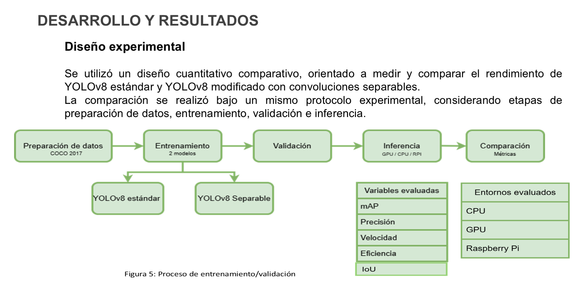

<p align="center"><em>Figure 5: Training / validation process.</em></p>

The methodological pillars are:

- **Comparative experimental design:** objective evaluation of two YOLOv8 versions (standard Conv2D vs. separable convolutions) under an identical training and inference protocol.
- **Model development:** architectural adaptation focused on the **Head** module, replacing standard layers with separable blocks to reduce computational complexity.
- **Training on COCO2017:** use of the standard dataset with the same data preparation, the same Train/Val split and a homogeneous hyperparameter setting.
- **Evaluation metrics:** multidimensional measurement balancing detection quality (mAP, IoU, precision, recall) against efficiency (inference speed and resources).
- **Multi-platform validation (GPU, CPU and Raspberry Pi):** analysis of the accuracy-vs-speed *trade-off* to determine the real feasibility of deployment on low-power hardware.

### 4.2 Dataset: COCO2017

**COCO** (*Common Objects in Context*) contains images with multiple objects interacting in real environments. Its 2017 version gathers roughly **330,000 images** (over 200,000 annotated) and about **1.5 million annotated object instances**, organized into **80 countable object categories** and 91 *stuff* categories (water, grass, sky) describing the environment.

This work used the standard split from the literature:

| Split | Images | Input resolution | Annotation format | Categories |
| :--- | ---: | :---: | :--- | ---: |
| **Train** | 118,287 | 640×640 | $(c_x, c_y, w, h)$ — YOLOv8 format | 80 |
| **Val** | 5,000 | 640×640 | $(c_x, c_y, w, h)$ — YOLOv8 format | 80 |

<p align="center"><em>Table 1: COCO2017 dataset.</em></p>

#### Coordinate transformation

COCO annotations define boxes as $(x_0, y_0, w, h)$, where $(x_0,y_0)$ is the top-left corner and $(w,h)$ the width and height in pixels. To make them compatible with the centre-based format used by YOLOv8, $(c_x, c_y, w, h)$:

$$c_x = x_0 + \frac{w}{2}, \qquad c_y = y_0 + \frac{h}{2}$$

When the source annotation comes in corner format $(x_0, y_0, x_1, y_1)$, the conversion is:

$$w = x_1 - x_0, \qquad h = y_1 - y_0, \qquad c_x = \frac{x_0 + x_1}{2}, \qquad c_y = \frac{y_0 + y_1}{2}$$

Both models share exactly the same data-preparation pipeline.

### 4.3 Model implementation

Both models were implemented in **TensorFlow / Keras** (`tensorflow==2.13.1`) on top of `keras_cv`, starting from the same backbone:

```python
stg = tf.distribute.MirroredStrategy()

with stg.scope():
    backbone = YOLOV8Backbone.from_preset("yolo_v8_xs_backbone", include_rescaling=True)
    YOLOV8_model = YOLOV8Detector(
        num_classes=num_classes,
        bounding_box_format="xyxy",
        backbone=backbone,
        fpn_depth=5,
    )

    optimizer = Adam(learning_rate=0.0007, weight_decay=0.0009, global_clipnorm=10.0)

    YOLOV8_model.compile(
        optimizer=optimizer,
        classification_loss="binary_crossentropy",
        box_loss="ciou",
    )
```

| Hyperparameter | Value |
| :--- | :--- |
| Backbone | `yolo_v8_xs_backbone` (`include_rescaling=True`) |
| FPN depth | 5 |
| Box format | `xyxy` |
| Optimizer | Adam — `lr=0.0007`, `weight_decay=0.0009`, `global_clipnorm=10.0` |
| Classification loss | `binary_crossentropy` |
| Box loss | `ciou` |
| Batch size | 16 |
| Input resolution | 640×640 (`JitteredResize`, `scale_factor=(0.8, 1.25)`) |
| Distribution strategy | `tf.distribute.MirroredStrategy` |
| Callbacks | `ModelCheckpoint` (best `val_loss`), `ReduceLROnPlateau` (`factor=0.01`, `patience=8`), `EarlyStopping` (`patience=20`) |

The development and training environment was the desktop PC described in Table 2 (Ryzen 7 5700X, 32 GB RAM, RTX 4060 Ti).

### 4.4 Proposed adaptation: Head with separable convolutional layers

Standard `Conv2D` layers were replaced with `SeparableConv2D` layers **only in the Head module**, leaving Backbone and Neck untouched. The substitution decomposes each convolution into:

1. A **depthwise convolution**, applying one filter per input channel independently and capturing channel-specific spatial patterns.
2. A **pointwise convolution**, fusing information across channels through $1\times1$ filters, providing the cross-channel combination required for classification and detection.

Functionally, the substitution affects the **Head's prediction branches** and, through them, the integration of multi-scale features coming from the Neck.

> **Implementation note:** the separable variant requires a **patched build of `keras_cv`** (`keras_cv-0.9.0.1-py3-none-any.whl`, installed locally in notebook `02`), since the official library does not expose a `SeparableConv2D`-based Head.

### 4.5 Epoch-count selection criterion

The number of training epochs was selected through an **incremental approach**, evaluating performance at **10-epoch intervals** and tracking the evolution of key metrics such as mAP and precision. Both models were trained on the same training set and evaluated on the same COCO2017 validation set, under identical performance metrics, so that observed differences could be attributed mainly to architectural characteristics rather than to variation in the data or the evaluation conditions.

### 4.6 Test hardware

| Component | Desktop PC | Raspberry Pi 4 |
| :--- | :--- | :--- |
| **Processor** | Ryzen 7 5700X (8C/16T, 3.4 GHz) | BCM2711 (ARM Cortex-A72, 1.5 GHz) |
| **GPU** | RTX 4060 Ti (8 GB GDDR6) | No GPU (CPU with NEON SIMD) |
| **RAM** | 32 GB DDR4 @ 3200 MHz | 8 GB LPDDR4 @ 2133 MHz |
| **Storage** | 1 TB NVMe SSD (PCIe 4.0) | 128 GB microSD |
| **Operating system** | Windows 10 Pro 64-bit | Raspberry Pi OS 64-bit |
| **Energy efficiency** | High consumption (65 W CPU, 160 W GPU) | Low consumption (~7 W) |
| **Processing** | CUDA / TensorRT support | CPU-dependent |

<p align="center"><em>Table 2: Test hardware specifications.</em></p>

### 4.7 Evaluation metrics

#### Precision

Measures the proportion of correct predictions relative to all predictions made:

$$\text{Precision} = \frac{TP}{TP + FP}$$

where $TP$ (*True Positives*) is the number of correct detections in which the detected object matches the true object, and $FP$ (*False Positives*) the number of incorrect detections where the model predicts a non-existent object. A high value means few erroneous detections — essential where false positives carry critical consequences.

#### Recall (sensitivity)

Measures the model's ability to detect **all** objects present in an image:

$$\text{Recall} = \frac{TP}{TP + FN}$$

where $FN$ (*False Negatives*) is the number of real objects the model failed to detect. High recall minimizes omissions, though it may come with more false positives.

#### Intersection over Union (IoU)

Quantifies the overlap between the predicted bounding box and the ground-truth box:

$$\text{IoU} = \frac{\text{Area}_{\text{Intersection}}}{\text{Area}_{\text{Union}}}$$

with:

$$\text{Area}_{\text{Intersection}} = \max(0,\; x_{\text{right}} - x_{\text{left}}) \times \max(0,\; y_{\text{bottom}} - y_{\text{top}})$$

$$\text{Area}_{\text{Union}} = \text{Area}_{\text{predicted}} + \text{Area}_{\text{true}} - \text{Area}_{\text{Intersection}}$$

where $x_{\text{left}}, y_{\text{top}}$ are the top-left corner coordinates of each box and $x_{\text{right}}, y_{\text{bottom}}$ those of the bottom-right corner.

Common thresholds:

| Threshold | Criterion | Typical use |
| :--- | :--- | :--- |
| **IoU = 0.50** | Permissive: 50 % overlap suffices | Video surveillance, traffic control |
| **IoU = 0.75** | Strict: demands greater spatial precision | Automated product inspection |
| **IoU = 0.95** | Extremely demanding | Small or partially occluded objects; electronics assembly |

Beyond evaluation, IoU takes part in training: it drives box regression by minimizing the loss function, determines whether a detection is TP or FP, and underpins NMS. A poorly calibrated threshold significantly affects reported performance: too high, and the matching criterion becomes so demanding that many valid detections are not counted as hits; too low, and the criterion accepts detections with far less spatial precision.

#### Average Precision (AP)

The area under the precision-recall curve, summarizing performance across confidence thresholds:

$$AP = \int_{0}^{1} P(r)\, dr$$

where $P(r)$ is the interpolated precision-recall curve.

#### Mean Average Precision (mAP)

The mean of AP values across all classes in the dataset:

$$mAP = \frac{1}{N} \sum_{i=1}^{N} AP_i$$

where $N$ is the total number of classes and $AP_i$ the average precision of class $i$.

- **mAP50** — computed at a fixed IoU threshold of 50 %. A permissive criterion; it provides an initial reference of how well the model detects objects without demanding exact box alignment. **This is the primary metric reported in this work.**
- **mAP50-95** — averaged over 10 IoU thresholds from 0.50 to 0.95 in steps of 0.05:

$$mAP_{50-95} = \frac{1}{10N} \sum_{j=1}^{10} \sum_{i=1}^{N} AP_{i,\, \text{IoU}=0.50 + 0.05(j-1)}$$

  where $j$ indexes each of the 10 thresholds, $N$ is the total number of classes and $AP_{i,\text{IoU}}$ the average precision of class $i$ at a specific threshold. It is the modern standard because it reflects performance from easy detections (IoU = 0.50) to highly precise, restrictive ones (IoU = 0.95).

#### Efficiency metrics

| Metric | Definition |
| :--- | :--- |
| **Inference speed (FPS)** | Images processed per second in each execution environment. |
| **Time per image ($\bar{t} \pm \sigma$)** | Mean latency and its standard deviation; the spread measures frame-to-frame stability. |
| **Memory / resource usage** | Parameter footprint and resource consumption on each device. |

---

## 5. DEVELOPMENT AND RESULTS

### 5.1 Model parameter comparison

| Model | Total parameters | Trainable parameters | Non-trainable parameters |
| :--- | ---: | ---: | ---: |
| **YOLOv8 Modified (Separable)** | **1,258,715 (4.80 MB)** | 1,245,819 (4.75 MB) | 12,896 (50.38 KB) |
| **YOLOv8 Base (Conv2D)** | 3,991,584 (15.23 MB) | 3,978,688 (15.18 MB) | 12,896 (50.38 KB) |

<p align="center"><em>Table 3: Parameters of the implemented YOLOv8 models.</em></p>

The Head substitution cut total parameters from ~3.99 million to ~1.25 million — a **reduction of roughly 68 %** — with the corresponding drop in memory consumption. The rest of this section addresses whether that compaction translates into a usable speed gain, and how much detection quality it costs.

### 5.2 Training cost

Training was the critical part of the thesis's experimental cost:

- Given model density, the size of COCO2017 (118,287 training images and 5,000 validation images) and the input resolution (640×640), **each epoch — including training and evaluation on the validation set — took between 10 and 12 hours** on the GPU used.
- Training 50 epochs of the Conv2D model and 100 epochs of the Separable model amounted to **several weeks of effective compute**.
- This time constraint limited the number of epochs that could be run and, consequently, **restricted systematic hyperparameter exploration** (batch size, learning rate, among others).
- Actual project time increased due to contingencies such as power outages, code errors and training restarts.

### 5.3 Performance evolution: mAP every 10 epochs

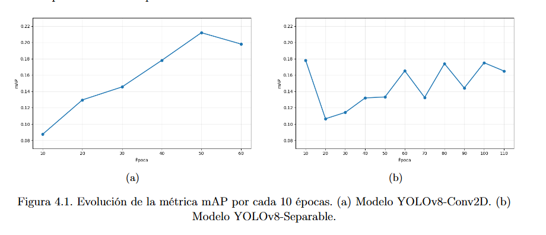

<p align="center"><em>Figure 6: Evolution of the mAP metric every 10 epochs. (a) YOLOv8-Conv2D model. (b) YOLOv8-Separable model.</em></p>

- **(a) YOLOv8-Conv2D:** mAP rises monotonically to ~0.21 at epoch 50 and then declines, suggesting the onset of **overfitting**. The final configuration was therefore fixed at **50 epochs**.
- **(b) YOLOv8-Separable:** convergence is **slower and markedly noisier**, oscillating between 0.10 and 0.18 without a clean upward trend. It required more iterations to approach its best observed performance, stabilizing around **100 epochs**.

### 5.4 Validation results per model

#### YOLOv8-Conv2D (50 epochs)

| Metric | Value |
| :--- | :--- |
| Model | YOLOv8-Conv2D |
| Epochs | 50 |
| **mAP50** | **0.2119** |
| Average IoU | 0.8367 |
| **Precision** | **0.6836** |
| **Recall** | **0.3260** |
| CPU FPS | 2.34 |
| GPU FPS | 5.48 |
| Raspberry Pi FPS | 0.07 |

<p align="center"><em>Table 4: YOLOv8-Conv2D model results.</em></p>

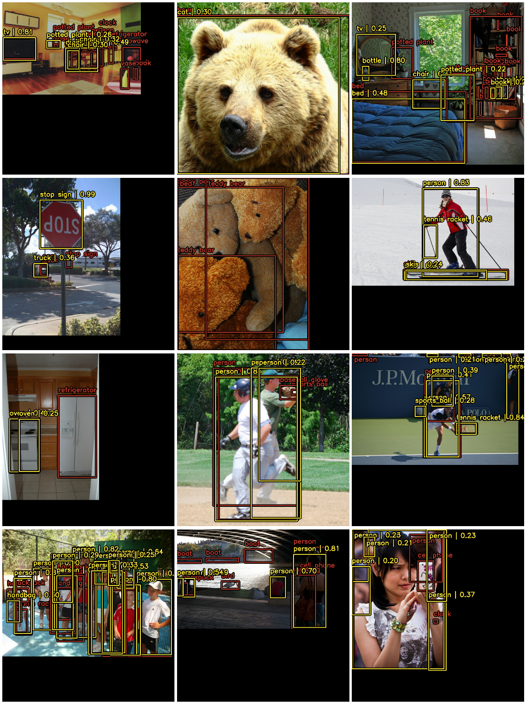

<p align="center"><em>Figure 7: Detection with YOLOv8-Conv2D trained for 50 epochs. Ground-truth boxes in red, model predictions in yellow, over COCO2017 validation images.</em></p>

The qualitative evidence shows that Conv2D keeps **more stable detections, particularly for medium and small objects**, with tighter bounding boxes.

#### YOLOv8-Separable (100 epochs)

| Metric | Value |
| :--- | :--- |
| Model | YOLOv8-Separable |
| Epochs | 100 |
| mAP50 | 0.1751 |
| Average IoU | 0.8302 |
| Precision | 0.6734 |
| Recall | 0.2933 |
| CPU FPS | 2.41 |
| GPU FPS | 5.36 |
| **Raspberry Pi FPS** | **0.68** |

<p align="center"><em>Table 5: YOLOv8-Separable model results.</em></p>

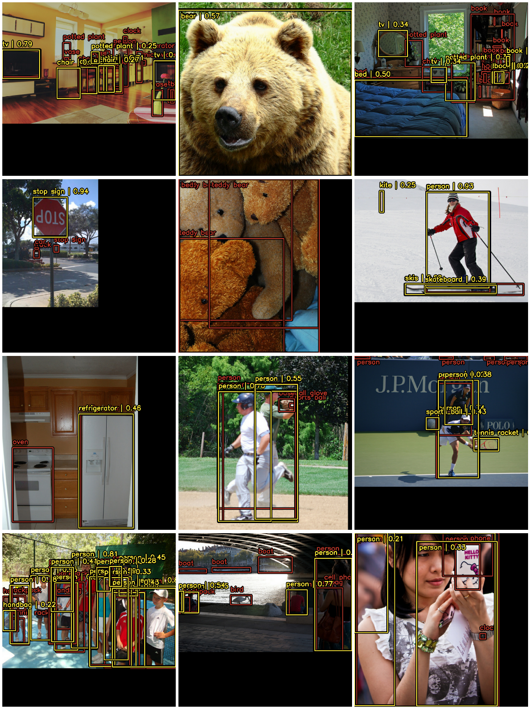

<p align="center"><em>Figure 8: Detection with YOLOv8-Separable trained for 100 epochs. Same visualization protocol and same validation images as Figure 7, for direct comparison.</em></p>

### 5.5 Overall validation and inference results

| Metric / Device | YOLOv8-Separable (100 epochs) | YOLOv8-Conv2D (50 epochs) |
| :--- | :---: | :---: |
| **Training epochs** | 100 | 50 |
| **mAP50** | 0.1751 | **0.2119** |
| **Average IoU** | 0.8302 | **0.8367** |
| **Precision** | 0.6734 | **0.6836** |
| **Recall** | 0.2933 | **0.3260** |
| **CPU FPS** | **2.41** | 2.34 |
| **GPU FPS** | 5.36 | **5.48** |
| **Raspberry Pi FPS** | **0.68** | 0.07 |
| **Mean CPU time ($\bar{t} \pm \sigma$) [s]** | **0.4156 ± 0.0136** | 0.4273 ± 0.0207 |
| **Mean GPU time ($\bar{t} \pm \sigma$) [s]** | 0.1866 ± 0.1671 | **0.1824 ± 0.0169** |
| **Mean Raspberry Pi time ($\bar{t} \pm \sigma$) [s]** | **1.4754 ± 0.0142** | 13.9322 ± 1.5230 |

<p align="center"><em>Table 6: Validation results for both models.</em></p>

### 5.6 Interpretation

#### Detection quality

**YOLOv8-Conv2D achieves the best performance across every quality metric** (mAP 0.2119 vs. 0.1751, plus better average IoU, precision and recall). This is consistent with its design: standard 2D convolutional layers give the network greater representational capacity, letting it model more complex patterns in COCO2017 images, which translates into better bounding boxes and a higher true-positive rate — at the cost of a significant increase in parameter count and associated compute.

A key point of the experiment: **the separable variant was trained for twice as many epochs (100 vs. 50) and still does not surpass Conv2D**. This indicates that the observed difference is explained mainly by **structural differences in representational capacity**, not by lack of convergence.

#### Speed on accelerated hardware

On the desktop computer, both models show **very similar FPS on CPU and on GPU alike** (2.34–2.41 FPS on CPU; 5.36–5.48 FPS on GPU). This suggests the bottleneck in that scenario lies mainly in:

- data loading,
- memory↔GPU transfers,
- and the TensorFlow runtime itself,

rather than in the exact parameter count of the model. A modern GPU (RTX 4060 Ti) **absorbs** the added complexity of Conv2D, so the separable version's theoretical FLOP advantage does not translate into a marked speed gain.

#### Speed on constrained hardware

The picture **changes notably on the Raspberry Pi**, where processing depends exclusively on the ARM Cortex-A72 CPU with no GPU acceleration:

| | YOLOv8-Conv2D | YOLOv8-Separable | Improvement |
| :--- | ---: | ---: | ---: |
| **FPS** | 0.07 | 0.68 | **≈ 9.7×** |
| **Time per image** | 13.9322 s | 1.4754 s | **≈ 9.4× faster** |
| **Standard deviation** | ± 1.5230 s | ± 0.0142 s | **≈ 107× less spread** |

The separable version is therefore not only nearly **an order of magnitude faster**, but also **far more stable in frame-to-frame latency** — a critical requirement for real-time applications on embedded hardware.

#### TensorFlow Lite export bottlenecks

The stability differences are directly tied to **how the models had to be adapted to TensorFlow Lite** in order to run on the Raspberry Pi:

1. **Unsupported operations.** During export, certain operations — notably **`DepthwiseConv2dNative`** — turned out not to be supported by TFLite's native kernels.
2. **Enabling Select TF Ops.** It was necessary to enable **Select TF Ops** (`tf.lite.OpsSet.SELECT_TF_OPS`) and **restructure the model graph** to complete the conversion.
3. **Splitting the inference graph.** For correct execution, **pure inference had to be explicitly separated** from the label-encoder stages and the **Non-Maximum Suppression (NMS)** process, keeping only the layers strictly required for prediction in the converted model.
4. **Residual cost of flex operations.** That restructuring allowed the trained architecture to be deployed, but meant **a fraction of the graph ran as *flex* operations**, which cannot always take full advantage of TFLite's internal optimizations or of the **XNNPACK** library.

The impact of this limitation is **most evident in the Conv2D model** — heavier and with greater memory bandwidth demand — which explains both its higher inference times and the greater variability observed in the measurements (± 1.52 s vs. ± 0.014 s).

### 5.7 Visualizations derived from the results

The charts below are built directly from the tables above via [`outputs/make_figures.py`](outputs/make_figures.py); no value was altered or estimated.

| | |
| :---: | :---: |
| 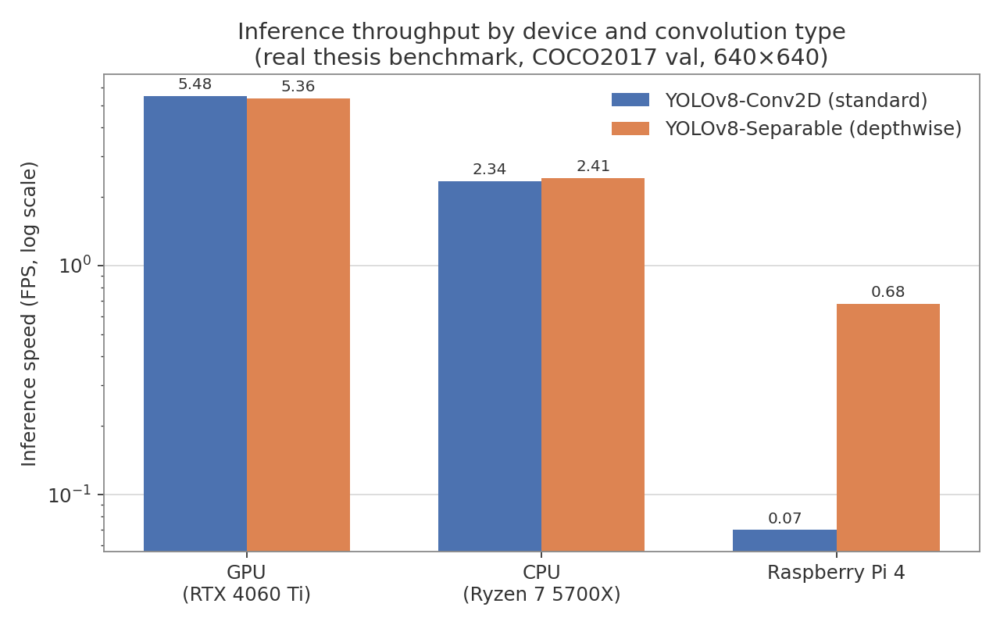 | 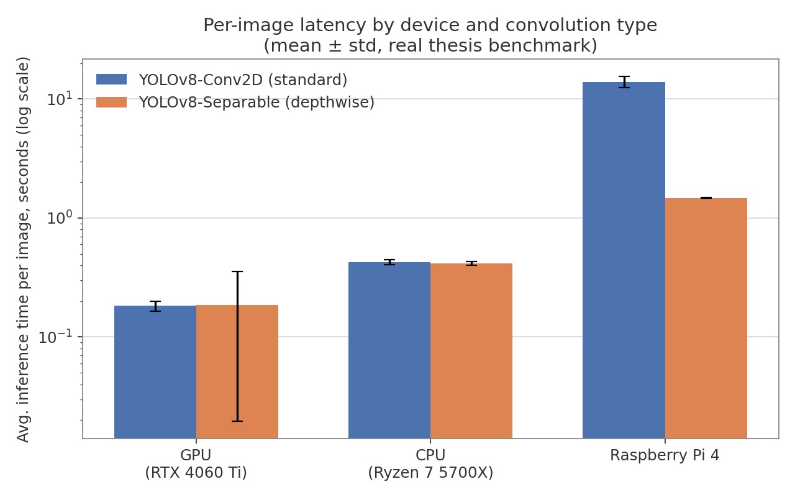 |
| 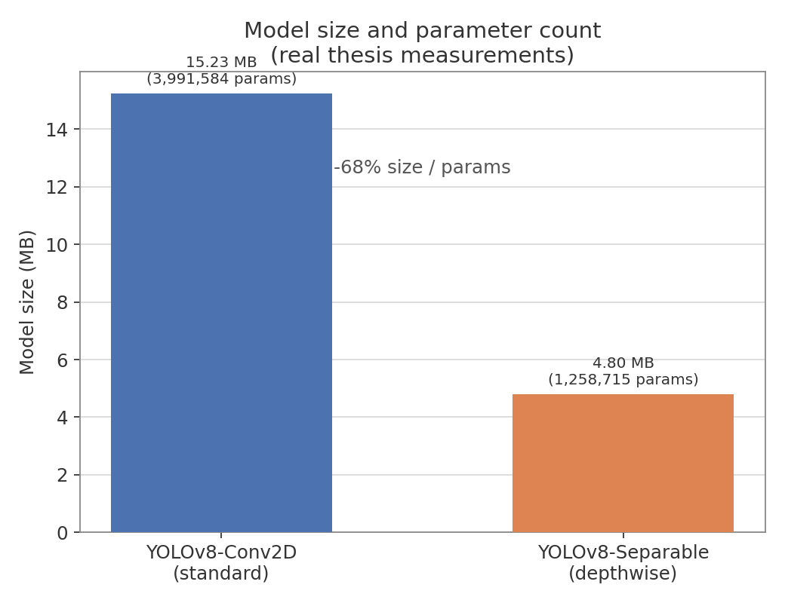 | 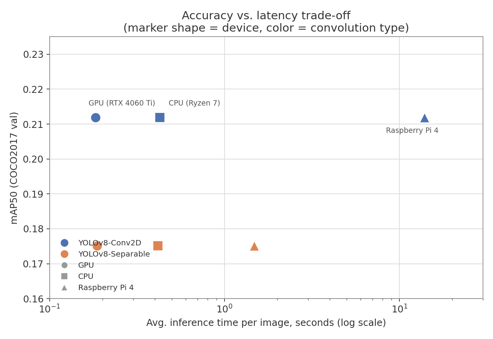 |

**Interactive chart:** [`outputs/make_interactive.py`](outputs/make_interactive.py) additionally builds a self-contained HTML chart (Plotly) of the accuracy-vs-latency trade-off across devices; hovering any point shows FPS, latency, mAP50 and parameter count for that device/architecture combination. It is built from the same measurement table and is not versioned in the repository — run the script to regenerate it under `outputs/interactive/`.

**Real training convergence (YOLOv8-Separable, 10-epoch log):**

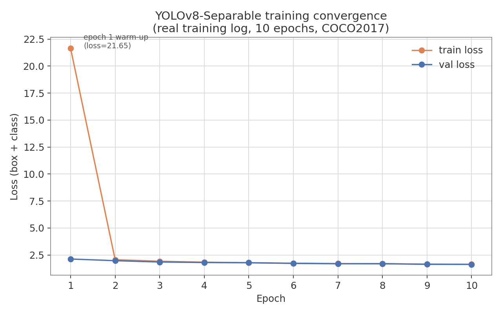

This curve is not a summary statistic: it is the epoch-by-epoch `box_loss` / `class_loss` / `val_loss` sequence saved in the output cell of `02_yolov8_separable_conv.ipynb` itself (`Epoch 1/10 … Epoch 10/10`), included so the reported metrics can be audited against the raw training log and not only against the final numbers.

---

## 6. CONCLUSIONS AND FUTURE WORK

### 6.1 Conclusions

**On the comparative objective.** Validation results showed that **YOLOv8-Conv2D holds an advantage in detection quality** on COCO2017 (mAP 0.2119 vs. 0.1751) **despite being trained for half as many epochs**, reinforcing that its greater representational capacity directly affects accuracy and localization.

**On embedded deployment.** On Raspberry Pi, the expected effect of substituting Conv2D with Separable is evident: the separable variant **drastically reduces latency and stabilizes inference** (0.68 vs. 0.07 FPS; 1.48 s vs. 13.93 s per image), confirming the link between computational efficiency and deployment feasibility in embedded environments.

**On the trade-off.** The standard-convolution model offers higher accuracy but at a considerably higher computational cost, reflected in longer prediction times and more intensive processing and memory usage — making it **less viable for embedded devices**. The separable-convolution model showed a **slight accuracy reduction** (−3.7 points of mAP50, −0.65 points of average IoU, −1.0 point of precision) while keeping performance **robust enough to remain within the acceptable threshold** for computer-vision applications, with a **68 % parameter reduction**.

**On the hypothesis.** The stated hypothesis does not hold in its literal reading — models adapted for reduced hardware did **not** reach higher accuracy than traditional ones — but it does hold when read **as a function of available resources**: on a platform without dedicated acceleration, the separable variant delivers nearly 10× more throughput at a marginal quality loss, making it the only one of the two configurations operationally usable in that context.

**On the selection criterion.** The architecture choice must align with the specific requirements of the application:

| Deployment context | Recommended model | Reason |
| :--- | :--- | :--- |
| High-performance GPU/CPU infrastructure, quality is the priority | **YOLOv8-Conv2D** | Better mAP, IoU, precision and recall; the latency penalty is marginal when acceleration is available. |
| Embedded / low-power systems where stable latency is an operational requirement | **YOLOv8-Separable** | ≈ 9.7× more FPS and ≈ 107× less latency spread on Raspberry Pi; 68 % smaller memory footprint. |

In conclusion, **choosing the right detection-model architecture can significantly improve processing efficiency without excessively compromising accuracy**, and the separable variant proves a viable alternative for collision-avoidance systems and other vision applications that must run continuously on low-power devices.

### 6.2 Limitations and scope of generalization

- **Domain:** performance estimation was restricted to **COCO2017**; the magnitude of the differences could vary in domains with different distributions.
- **Platforms:** **two** environments were evaluated (desktop and Raspberry Pi 4); behaviour on embedded hardware *with* dedicated acceleration remains unmeasured.
- **Experimental asymmetry:** the configurations differed in epoch count (50 for Conv2D, 100 for Separable). Nonetheless, the persistent gap — in favour of the model trained for *less* time — suggests the dominant factor is architectural rather than convergence-related.
- **Conversion pipeline:** the Raspberry Pi measurements depended on the TensorFlow Lite conversion and deployment process, which can affect absolute latencies. **Times should be interpreted primarily as relative between models**, not as absolute values transferable to another export pipeline.
- **Compute budget:** the 10–12 hours per epoch prevented systematic hyperparameter exploration; the mAP values reached are below those reported by official implementations trained with far larger budgets.

### 6.3 Future work

**Performance evaluation on different hardware**

| Platform | What it would allow evaluating |
| :--- | :--- |
| **Google Edge TPU** | Efficiency of optimized models on IoT devices with low energy consumption. |
| **NVIDIA Jetson** | Standard environment in robotics and automation, where inference-latency optimization is critical. |
| **FPGAs and NPUs** | Purpose-specific configurations to accelerate vision-model inference, with potential efficiency and consumption gains. |

**Other directions**

- **Compression techniques:** weight quantization (INT8) and parameter pruning, combined with hardware acceleration, to improve efficiency without drastically sacrificing performance.
- **Comparison with ultra-light detectors:** NanoDet, MobileNet-SSD and PP-YOLO, to position the separable variant within the state of the art of models designed from the ground up for the edge.
- **Accuracy recovery:** targeted *fine-tuning* of the separable variant to close part of the mAP gap.
- **Real-deployment validation:** measuring detection latency, energy consumption and stability in production, across different datasets and application scenarios.

---

## 7. REPOSITORY STRUCTURE

```
yolov8-separable-convolutions/
├── 01_yolov8_standard_conv2d.ipynb            # Training and evaluation of YOLOv8-Conv2D (baseline)
├── 02_yolov8_separable_conv.ipynb             # Training and evaluation of YOLOv8-Separable (separable Head)
├── docs/
│   └── images/
│       ├── figura1_ejemplo_yolo.png           # Fig. 1 — Object detection within the vision-task map
│       ├── figura2_arquitectura_yolov8.png    # Fig. 2 — Backbone / Neck / Head architecture
│       ├── figura3_conv2d_vs_separable.png    # Fig. 3 — Conv2D vs SeparableConv2D
│       ├── figura4_procesos_convolucion.png   # Fig. 4 — Standard and separable convolution processes
│       ├── figura5_proceso_entrenamiento.png  # Fig. 5 — Experimental design
│       ├── figura6_map_epocas.png             # Fig. 6 — mAP every 10 epochs
│       ├── figura7_deteccion_conv2d.png       # Fig. 7 — YOLOv8-Conv2D detections (50 epochs)
│       └── figura8_deteccion_separable.png    # Fig. 8 — YOLOv8-Separable detections (100 epochs)
├── outputs/
│   ├── make_figures.py                        # Builds the static charts from the results table
│   ├── make_interactive.py                    # Builds the interactive trade-off chart (Plotly)
│   └── figures/
│       ├── fps_by_device.png                  # Generated — FPS by device
│       ├── latency_by_device.png              # Generated — inference latency by device
│       ├── map_vs_latency_tradeoff.png        # Generated — accuracy vs. latency trade-off
│       ├── model_size_comparison.png          # Generated — model size on disk
│       ├── training_convergence_separable.png # Generated — separable model convergence
│       ├── CONV2_50Epoch.png                  # Thesis original — YOLOv8-Conv2D inference
│       ├── SEP_100EPOCH.png                   # Thesis original — YOLOv8-Separable inference
│       ├── mAP.png                            # Thesis original — mAP50 curves
│       ├── comparacion modelos.png            # Thesis original — Table 2.1, state of the art
│       ├── comparcion.png                     # Thesis original — Table 3, parameters
│       ├── tabla 3.png                        # Thesis original — parameter summary
│       ├── tabla resultados tesis.png         # Thesis original — consolidated Table 6
│       └── yolo_arq.pdf                       # Thesis original — architecture schematic
├── .gitattributes                             # Line-ending normalization (LF)
├── README.md                                  # Spanish version
├── README.en.md                               # This document (English)
└── LICENSE                                    # MIT
```

> The figures under `docs/images/` are the ones numbered in this document (Figures 1–8). Those in `outputs/figures/` are of two kinds: charts generated by `make_figures.py` from the results table, and original crops from the thesis document uploaded to the repository, several of which duplicate content already present here as a native table or a numbered figure.

### Notebooks

| Notebook | Contents |
| :--- | :--- |
| [`01_yolov8_standard_conv2d.ipynb`](01_yolov8_standard_conv2d.ipynb) | Control model. COCO annotation loading and transformation, `tf.data` generators with `JitteredResize`, `YOLOV8Detector` construction with the standard Head, training, detection visualization and a from-scratch IoU / AP / mAP computation. |
| [`02_yolov8_separable_conv.ipynb`](02_yolov8_separable_conv.ipynb) | Treatment model. Same pipeline, installing the patched `keras_cv-0.9.0.1` build with a `SeparableConv2D`-based Head. Its saved output cells keep the `model.summary()` reporting `Total params: 1,258,715 (4.80 MB)` and the training log. |

---

## 8. REPRODUCING THE EXPERIMENT

### Requirements

```bash
python -m pip install tensorflow==2.13.1
python -m pip install keras_cv                             # notebook 01 (standard Head)
python -m pip install keras_cv-0.9.0.1-py3-none-any.whl    # notebook 02 (separable Head, patched build)
python -m pip install pandas tqdm scikit-learn matplotlib opencv-python
```

### Data

Download COCO2017 and lay it out as follows:

```
coco2017/
├── train2017/                                  # 118,287 images
├── val2017/                                    #   5,000 images
└── annotations/
    ├── instances_train2017.json
    └── instances_val2017.json
```

### Regenerating the charts

```bash
python outputs/make_figures.py
python outputs/make_interactive.py
```

### Reproducibility note

The GPU / CPU / Raspberry Pi benchmarks reported in this README are the **thesis's original measurements**, obtained on the hardware described in Table 2 (Ryzen 7 5700X + RTX 4060 Ti desktop, and a physical Raspberry Pi 4), with an environment pinned to `tensorflow==2.13.1` and the patched `keras_cv` build.

Reproducing them exactly requires that same hardware/software combination, the full COCO2017 dataset (~19 GB) and the trained checkpoints. Running them on different hardware would not "verify" the thesis numbers: it would produce a different, non-comparable benchmark. For that reason **no number in Section 5 was recomputed or replaced** while writing this documentation; the only derived artifacts are the charts in Section 5.7, generated directly from those measurements.

---

## 9. REFERENCES

Principal references cited in the theoretical framework and the methodology:

- Chollet, F. (2017). *Xception: Deep Learning with Depthwise Separable Convolutions*.
- Howard, A. G., et al. (2017). *MobileNets: Efficient Convolutional Neural Networks for Mobile Vision Applications*.
- Sandler, M., et al. (2018). *MobileNetV2: Inverted Residuals and Linear Bottlenecks*.
- He, K., et al. (2016). *Deep Residual Learning for Image Recognition*.
- Ioffe, S., & Szegedy, C. (2015). *Batch Normalization: Accelerating Deep Network Training by Reducing Internal Covariate Shift*.
- Lin, T.-Y., et al. (2014). *Microsoft COCO: Common Objects in Context*.
- Redmon, J., et al. (2016). *You Only Look Once: Unified, Real-Time Object Detection*.
- Bochkovskiy, A., et al. (2020). *YOLOv4: Optimal Speed and Accuracy of Object Detection*.
- Wang, C.-Y., et al. (2019). *CSPNet: A New Backbone that can Enhance Learning Capability of CNN*.
- Terven, J., et al. (2023). *A Comprehensive Review of YOLO Architectures in Computer Vision*.
- Varghese, R., & M., S. (2024). *YOLOv8: A Novel Object Detection Algorithm with Enhanced Performance and Robustness*.
- Neubeck, A., & Van Gool, L. (2006). *Efficient Non-Maximum Suppression*.
- Han, S., et al. (2016). *Deep Compression: Compressing Deep Neural Networks with Pruning, Trained Quantization and Huffman Coding*.
- Jouppi, N. P., et al. (2017). *In-Datacenter Performance Analysis of a Tensor Processing Unit*.
- Liu, L., et al. (2020). *Deep Learning for Generic Object Detection: A Survey*.
- Zou, Z., et al. (2019). *Object Detection in 20 Years: A Survey*.
- Ultralytics (2024). *YOLOv8 Documentation*.

> Figures 1 to 8 come from the thesis document and the defence presentation. Figure 2 reproduces the architecture diagram from Terven et al. (2023).

---

## LICENSE

MIT — see [LICENSE](LICENSE).

---

## AUTHOR

**Pablo Vicente Reyes Pino**
Thesis Project — Computer and Informatics Civil Engineering
Universidad Mayor · Santiago, Chile · April 2026
Advisor: Dr. Anthony D. Cho · Reviewer: Carlos Muñoz
