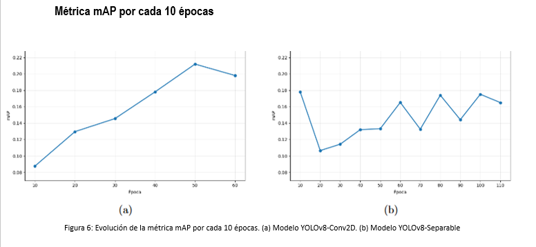

# Evaluación de la Eficiencia de YOLOv8 en GPU, CPU y Raspberry Pi: Convoluciones Estándar vs. Separables


> **Proyecto de Tesis:** Evaluación del compromiso (*trade-off*) entre calidad de detección de objetos y eficiencia computacional en arquitecturas YOLOv8 en entornos restringidos.

---

## Datos Académicos

* **Autor:** Pablo Vicente Reyes Pino
* **Profesor Guía:** Dr. Anthony D. Cho
* **Profesor Revisor:** Carlos Muñoz
* **Institución:** Escuela de Ingeniería Civil en Computación e Informática, Facultad de Ciencias, Ingeniería y Tecnología, Universidad Mayor (Santiago, Chile)
* **Fecha:** Abril / Julio 2026

---

## Resumen y Motivación

La detección de objetos en tiempo real es fundamental en sistemas de visión artificial modernos, como conducción autónoma, videovigilancia y robótica industrial. No obstante, los modelos de aprendizaje profundo tradicionales requieren una elevada capacidad de procesamiento que dificulta su despliegue en dispositivos de borde (*edge computing*) o hardware de capacidades reducidas.

Esta investigación evalúa el comportamiento del modelo **YOLOv8** modificando su módulo de detección (*Head*) mediante la sustitución de convoluciones 2D estándar (**YOLOv8-Conv2D**) por convoluciones separables en profundidad (**YOLOv8-Separable**). La modificación se concentra en la etapa final de predicción para reducir el costo computacional sin alterar severamente la extracción multiescala de características realizada por el *Backbone* y *Neck*. Ambos modelos fueron probados bajo un estricto protocolo experimental idéntico a lo largo de tres perfiles de hardware distintos: GPU dedicada, CPU de escritorio y una plataforma embebida Raspberry Pi 4.

---

## Hipótesis de Investigación

> *"Los modelos de Deep Learning adaptados para hardware reducido tendrán una precisión mayor que los modelos de Deep Learning tradicionales en función de los recursos disponibles, comparando métricas específicas de rendimiento."*

---

## Marco Teórico y Modificación Arquitectónica

El modelo YOLOv8 organiza su flujo en tres módulos principales: **Backbone** (extracción de características con CSPDarknet y activación SiLU), **Neck** (fusión multiescala vía FPN y PANet con bloques C2f y SPPF) y **Head** (generación de predicciones de cajas delimitadoras y clasificación).

### Convolución Conv2D (Estándar)
Aplica un filtro tridimensional completo sobre todos los canales de entrada simultáneamente. El número de parámetros requeridos para un kernel de tamaño $k$ con $C_{\text{in}}$ canales de entrada y $C_{\text{out}}$ filtros de salida es:

$$P_{\text{conv-std}} = k \times k \times C_{\text{in}} \times C_{\text{out}}$$

### Convolución Separable en Profundidad
Factoriza la operación convolucional estándar en dos etapas independientes:
1. **Convolución Depthwise:** Aplica un filtro espacial $k \times k$ a cada canal de entrada de forma individual sin mezclar información entre canales.
   $$P_{\text{depthwise}} = k \times k \times C_{\text{in}}$$
2. **Convolución Pointwise:** Realiza una proyección lineal $1 \times 1$ a través de todos los canales para mezclar la información espacial obtenida.
   $$P_{\text{pointwise}} = C_{\text{in}} \times C_{\text{out}}$$

Esta sustitución estratégica en las capas del módulo *Head* reduce la complejidad computacional total y el número de parámetros del modelo en aproximadamente un **68%**, aliviando la carga sobre la memoria caché y las unidades aritméticas del procesador.

---

## Entornos de Hardware y Justificación de Plataformas

| Especificación | PC de Escritorio (GPU) | PC de Escritorio (CPU) | Raspberry Pi 4 | ESP32-CAM |
| :--- | :--- | :--- | :--- | :--- |
| **Procesador** | AMD Ryzen 7 5700X (8C/16T, 3.4 GHz) | AMD Ryzen 7 5700X | Broadcom BCM2711 (Quad-core ARM Cortex-A72 @ 1.5 GHz) | ESP32-D0WDQ6 Dual-core @ 240 MHz |
| **Acelerador Gráfico** | NVIDIA RTX 4060 Ti (8 GB GDDR6) | Sin GPU dedicada | Sin GPU dedicada (ARM NEON SIMD) | Sin acelerador |
| **Memoria RAM** | 32 GB DDR4 3200 MHz | 32 GB DDR4 | 8 GB LPDDR4 2133 MHz | 520 KB SRAM + 4 MB PSRAM |
| **Consumo Energético** | ~160W (GPU) + 65W (CPU) | ~65W | **~7W** | Ultra bajo (<2W) |
| **Runtime / Framework** | TensorFlow / Keras (CUDA / TensorRT) | TensorFlow CPU | TensorFlow Lite / XNNPACK | Incompatible |
| **Estado de Despliegue** | Evaluado | Evaluado | **Evaluado** | **Descartado** (memoria insuficiente) |

### Análisis de Viabilidad de Dispositivos Embebidos

* **Raspberry Pi 4:** Representa el entorno borde objetivo. Su procesador ARM de 64 bits con soporte de instrucciones vectoriales NEON permite ejecutar el motor TensorFlow Lite mediante delegados XNNPACK, convirtiéndolo en la plataforma ideal para evaluar la ganancia de velocidad de arquitecturas optimizadas.
* **Descarte de ESP32-CAM:** Fue evaluado como alternativa microcontroladora de consumo ultra bajo. Sin embargo, con solo 520 KB de SRAM interna y 4 MB de PSRAM externa, el hardware resultó incapaz de asignar la memoria del grafo de ejecución de YOLOv8 durante la fase de inicialización (*tensor arena allocation*), provocando errores fatales por desbordamiento de memoria (Out-Of-Memory).

---

## Configuración del Dataset y Metodología de Entrenamiento

* **Dataset:** COCO2017 (80 categorías de objetos etiquetados en escenarios reales).
* **Partición de datos:** 118,287 imágenes para entrenamiento y 5,000 para validación.
* **Resolución de entrada:** 640×640 píxeles con escalado y normalización estándar.
* **Costo computacional de entrenamiento:** Entre 10 y 12 horas por época en GPU dedicada NVIDIA RTX 4060 Ti.
* **Divergencia en Criterios de Convergencia:**
  * **YOLOv8-Conv2D:** Entrenado durante **50 épocas**. Dada su mayor densidad de parámetros y capacidad representacional por capa, la red estabilizó su función de pérdida rápidamente y alcanzó el punto óptimo antes de mostrar indicios de sobreajuste.
  * **YOLOv8-Separable:** Entrenado durante **100 épocas**. Al desacoplar el aprendizaje espacial del canal, las capas separables poseen menor expresividad individual, requiriendo un proceso de optimización por descenso de gradiente más prolongado para ajustar las relaciones complejas entre características multiescala.

---

## Resultados Experimentales

### 1. Desglose y Comparación de Parámetros de los Modelos


> Al comparar los parámetros del modelo (Conv2D vs Separable) se aprecia el costo-beneficio entre eficiencia y exactitud. Al implementar convoluciones separables en el modelo, se logró reducir los parámetros en un 68%, bajando de 3.99 a 1.25 millones. Si bien esto significó una pequeña caída en la precisión de 0.21 a 0.17, la ventaja al operar en equipos limitados fue gigante. Se logró destrabar el cuello de botella en nuestra placa, acelerando el procesamiento diez veces para pasar de 14 a solo 1.48 segundos por imagen. Sumado a esto, se consiguió estabilizar bastante los tiempos de respuesta. En el fondo, se demostró que este pequeño costo en precisión es la clave que realmente permite ejecutar modelos de visión artificial en dispositivos de bajos recursos.

| Métrica de Arquitectura | YOLOv8-Conv2D | YOLOv8-Separable | Reducción |
| :--- | :--- | :--- | :--- |
| **Parámetros Totales** | 3,991,584 (15.23 MB) | **1,258,715 (4.80 MB)** | **-68.46%** |
| **Parámetros Entrenables** | 3,978,688 (15.18 MB) | **1,245,819 (4.75 MB)** | **-68.68%** |
| **Parámetros No Entrenables** | 12,896 (50.38 KB) | 12,896 (50.38 KB) | 0% |

---

### 2. Métricas de Calidad de Detección y Eficiencia Computacional en Hardware


> Para analizar estos resultados, debemos separar el comportamiento del modelo según el hardware.
>
> En términos de precisión y entrenamiento, el modelo Conv2D clásico lidera con un mAP50 de 0.2119, superando el 0.1751 de nuestra variante Separable, y convergiendo en la mitad del tiempo (50 épocas frente a 100). De hecho, si se evalúa la inferencia en una infraestructura potente, como una CPU o GPU de escritorio, los tiempos son casi iguales, por lo que en ese escenario el modelo clásico es la opción indiscutida.
>
> Sin embargo, el objetivo central del proyecto es operar en dispositivos de bajos recursos, y ahí es donde se justifica nuestra propuesta. Al implementar convoluciones separables, logramos reducir el peso de la arquitectura en un 68%, pasando de 3.99 a solo 1.25 millones de parámetros.
>
> El impacto crítico de esta optimización se evidencia en el despliegue sobre la Raspberry Pi. Mientras el modelo estándar resulta totalmente inviable, operando a 0.07 FPS (casi 14 segundos por imagen), el modelo Separable viabiliza por completo el despliegue. Se logró desplomar ese tiempo a 1.48 segundos por imagen (0.68 FPS), lo que se traduce en una aceleración de casi 10 veces respecto al original. Aún más importante, logramos una desviación estándar de apenas ±0.0142 segundos, lo que demuestra empíricamente que pasamos de un entorno inoperable a una ejecución completamente estable y predecible.

| Plataforma de Prueba | Modelo | FPS | Tiempo Promedio por Imagen ($\overline{t} \pm \sigma$) |
| :--- | :--- | :---: | :---: |
| **PC - GPU (RTX 4060 Ti)** | **YOLOv8-Conv2D**<br>**YOLOv8-Separable** | **5.48 FPS**<br>5.36 FPS | $0.1824 \pm 0.0169\text{ s}$<br>$0.1866 \pm 0.1671\text{ s}$ |
| **PC - CPU (Ryzen 7)** | **YOLOv8-Conv2D**<br>**YOLOv8-Separable** | 2.34 FPS<br>**2.41 FPS** | $0.4273 \pm 0.0207\text{ s}$<br>$0.4156 \pm 0.0136\text{ s}$ |
| **Raspberry Pi 4** | **YOLOv8-Conv2D**<br>**YOLOv8-Separable** | 0.07 FPS<br>**0.68 FPS** | $13.9322 \pm 1.5230\text{ s}$<br>**$1.4754 \pm 0.0142\text{ s}$** |

---

## Visualizaciones de Resultados

### Evolución de la Métrica mAP por Épocas



> Al analizar la evolución de la métrica mAP, notamos dos comportamientos muy marcados. El modelo Conv2D, dada su mayor complejidad, convergió de manera bastante rápida y logró extraer características de forma estable. Por otro lado, el modelo Separable, al tener menor capacidad de representación, presentó mayores fluctuaciones; le costó bastante más estabilizar la función de pérdida y obligó a completar las 100 épocas de entrenamiento para que los pesos lograran converger.

* **Gráfico interactivo:** [Análisis Trade-off mAP vs Latencia](https://htmlpreview.github.io/?https://github.com/Rxyxs/yolov8-separable-convolutions/blob/main/outputs/interactive/latency_map_tradeoff.html)

---

## Conclusiones Principales

* **Entornos con aceleración dedicada (GPU / CPU potente):** El modelo **YOLOv8-Conv2D** ofrece el mejor desempeño general en mAP50, IoU y Recall. En este hardware, la arquitectura masiva de los Tensor Cores absorbe sin problemas la carga de las convoluciones 2D estándar, por lo que la reducción de parámetros del modelo Separable no ofrece ventajas en latencia (5.48 vs 5.36 FPS).
* **Entornos embebidos restringidos (Raspberry Pi 4):** El beneficio de **YOLOv8-Separable** es determinante. Permite transformar un modelo inoperable (13.93 s por cuadro) en un sistema funcional (1.47 s por cuadro), multiplicando la tasa de procesamiento por casi 10 veces y reduciendo significativamente la dispersión temporal ($\sigma = \pm 0.0142\text{ s}$).
* **Compromiso precisión vs. velocidad:** Se valida el *trade-off* fundamental de la hipótesis: asumir una leve reducción en mAP50 (~3.68%) resulta ser una estrategia eficiente y necesaria para habilitar la ejecución de modelos avanzados de visión artificial en dispositivos de bajo consumo energético y recursos reducidos.

---

## Futuras Líneas de Investigación

* **Despliegue en Aceleradores Dedicated Edge:** Evaluar el rendimiento en plataformas con NPUs y aceleradores TPU de bajo consumo, como Google Coral Edge TPU, NVIDIA Jetson Nano/Orin y FPGAs.
* **Técnicas Complementarias de Compresión:** Aplicar cuantización post-entrenamiento (*INT8 / FP16*) y técnicas de destilación de conocimiento (*Knowledge Distillation*) sobre el modelo separable para recuperar la precisión perdida sin aumentar la latencia.
* **Evaluación de Consumo Físico:** Realizar mediciones directas de corriente (Amperios), potencia consumida (Watts) y estrangulamiento térmico (*thermal throttling*) durante operaciones sostenidas de inferencia continua.

---

## Referencia Académica y Créditos

Si utilizas este trabajo o código en tu investigación, favor citar:

```bibtex
@thesis{reyespino2026yolov8,
  author      = {Pablo Vicente Reyes Pino},
  title       = {Evaluación de la eficiencia de YOLOv8 en GPU, CPU y Raspberry Pi: Convoluciones estándar vs separables},
  school      = {Universidad Mayor},
  faculty     = {Facultad de Ciencias, Ingeniería y Tecnología},
  department  = {Escuela de Ingeniería Civil en Computación e Informática},
  advisor     = {Dr. Anthony D. Cho},
  address     = {Santiago, Chile},
  year        = {2026}
}
