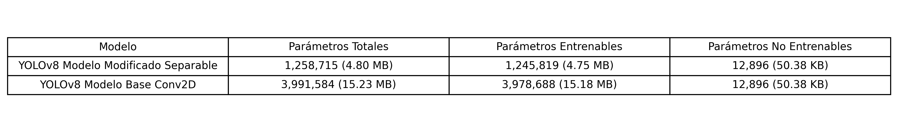
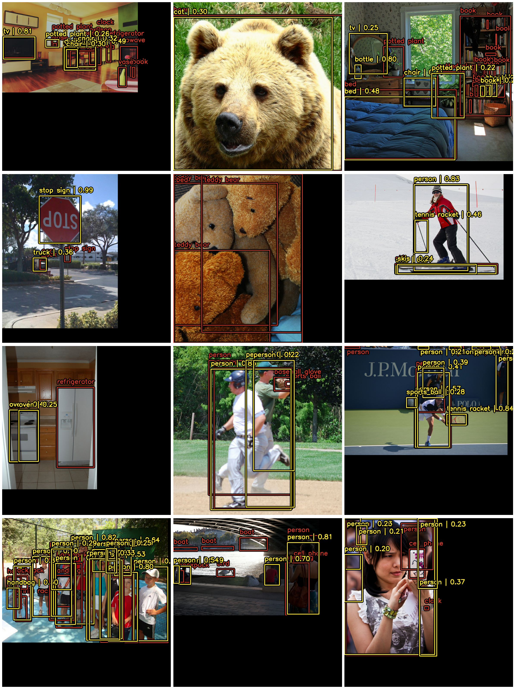
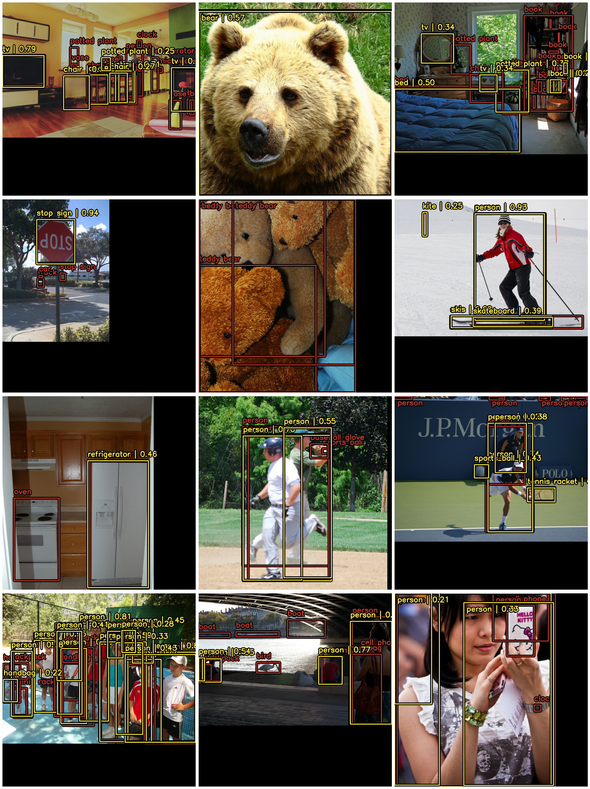

# Evaluación de la Eficiencia de YOLOv8 en GPU, CPU y Raspberry Pi: Convoluciones Estándar vs. Separables

> **Proyecto de Tesis:** Evaluación del compromiso (*trade-off*) entre calidad de detección de objetos y eficiencia computacional en arquitecturas YOLOv8 en entornos restringidos.

---

## Datos Académicos

* **Autor:** Pablo Vicente Reyes Pino
* **Profesor Guía:** Dr. Anthony D. Cho
* **Profesor Revisor:** Carlos Muñoz
* **Institución:** Escuela de Ingeniería Civil en Computación e Informática, Facultad de Ciencias, Ingeniería y Tecnología, Universidad Mayor (Santiago, Chile)
* **Fecha:** Abril / Julio 2026

---

## Resumen y Motivación

La detección de objetos en tiempo real es fundamental en sistemas de visión artificial modernos, como conducción autónoma, videovigilancia y robótica industrial. No obstante, los modelos de aprendizaje profundo tradicionales exigen una elevada capacidad de procesamiento que dificulta su despliegue en dispositivos de borde (*edge computing*) o hardware de capacidades reducidas.

Esta investigación evalúa el comportamiento del modelo **YOLOv8** modificando su módulo de detección (*Head*), sustituyendo las convoluciones 2D estándar (**YOLOv8-Conv2D**) por convoluciones separables en profundidad (**YOLOv8-Separable**). Ambos modelos fueron evaluados bajo un estricto protocolo experimental idéntico a lo largo de tres perfiles de hardware distintos: GPU dedicada, CPU de escritorio y una plataforma embebida Raspberry Pi 4.

---

## Estado del Arte: Comparación de Modelos de Detección

> **Análisis:** Los modelos clásicos como SIFT y HOG dependen de la extracción manual de características, lo que limita su capacidad ante alta variabilidad. Si bien las arquitecturas R-CNN y sus derivadas introdujeron una alta precisión mediante propuestas de regiones, su diseño en múltiples etapas genera cuellos de botella computacionales. YOLO transformó este paradigma al realizar la detección en una sola pasada (*one-stage detector*), permitiendo procesamiento en tiempo real. Esta tesis busca mantener la ventaja táctica de YOLO pero mitigando su demanda de recursos para hacerlo viable en la capa física de IoT.

---

## Hipótesis de Investigación

> *"Los modelos de Deep Learning adaptados para hardware reducido tendrán una precisión mayor que los modelos de Deep Learning tradicionales en función de los recursos disponibles, comparando métricas específicas de rendimiento."*

---

## Marco Teórico y Modificación Arquitectónica

### Análisis de la Arquitectura Base (YOLOv8)

De acuerdo al diagrama arquitectónico analizado, el modelo YOLOv8 estructura su flujo de datos en tres macrosecciones interconectadas[cite: 3]:

1. **Backbone:** Encargado de procesar la entrada inicial de dimensiones $640\times640\times3$. Utiliza una secuencia de capas ConvModule y cuellos de botella (DarknetBottleneck) integrados en bloques C2f, culminando en un módulo SPPF para agrupar características espaciales[cite: 3].
2. **Neck:** Integra las características multiescala extraídas en las etapas P3, P4 y P5[cite: 3]. Mediante operaciones Upsample, Concat y bloques C2f adicionales, fusiona la semántica profunda con los detalles espaciales de las primeras capas[cite: 3].
3. **Head:** Se bifurca en dos ramas independientes para cada escala ($80\times80$, $40\times40$ y $20\times20$)[cite: 3]. Una rama computa la pérdida de clasificación (Cls Loss BCE) y la otra calcula la regresión de cajas delimitadoras (Bbox Loss CIoU + DFL)[cite: 3].

La intervención arquitectónica propuesta en esta investigación se aplica **únicamente en las capas Conv2d terminales del módulo Head**[cite: 3], sustituyéndolas por convoluciones separables para reducir la carga de parámetros sin alterar la extracción de características del Backbone y Neck[cite: 3].

---

### Modificación Matemática

**Convolución Conv2D (Estándar):**  
Aplica un filtro tridimensional completo. Para un kernel de tamaño $k$ con $C_{in}$ canales de entrada y $C_{out}$ filtros de salida, el costo paramétrico es:
$$P_{estandar}=k\times k\times C_{in}\times C_{out}$$

**Convolución Separable en Profundidad:**  
Factoriza la operación en dos etapas:
1. **Depthwise:** Filtro espacial $k \times k$ a cada canal individual.
   $$P_{depthwise}=k\times k\times C_{in}$$
2. **Pointwise:** Proyección lineal $1 \times 1$ para mezclar canales.
   $$P_{pointwise}=C_{in}\times C_{out}$$

---

## Entornos de Hardware y Viabilidad

| Especificación | PC de Escritorio (GPU) | PC de Escritorio (CPU) | Raspberry Pi 4 |
| :--- | :--- | :--- | :--- |
| **Procesador** | AMD Ryzen 7 5700X | AMD Ryzen 7 5700X | Broadcom BCM2711 (ARM) |
| **Acelerador Gráfico** | NVIDIA RTX 4060 Ti | Sin GPU dedicada | Sin GPU dedicada |
| **Consumo Energético** | ~160W (GPU) + 65W (CPU) | ~65W | **~7W** |
| **Runtime / Framework** | TensorFlow / Keras (CUDA) | TensorFlow CPU | TensorFlow Lite (XNNPACK) |

> **Nota de Viabilidad:** El hardware ESP32-CAM fue descartado durante las pruebas iniciales debido a desbordamientos de memoria (*Out-Of-Memory*) al intentar asignar el grafo de tensores.

---

## Resultados Experimentales

### 1. Compresión del Modelo y Parámetros

#### Tabla 3: Comparación de parámetros del modelo (Conv2D vs Separable)

| Modelo | Parámetros Totales | Parámetros Entrenables | Parámetros No Entrenables |
| :--- | :---: | :---: | :---: |
| **YOLOv8 Modelo Modificado Separable** | **1,258,715 (4.80 MB)**[cite: 4] | 1,245,819 (4.75 MB)[cite: 4] | 12,896 (50.38 KB)[cite: 4] |
| **YOLOv8 Modelo Base Conv2D** | **3,991,584 (15.23 MB)**[cite: 4] | 3,978,688 (15.18 MB)[cite: 4] | 12,896 (50.38 KB)[cite: 4] |

> **Análisis:** Al comparar la densidad de la arquitectura, se aprecia una optimización drástica. Al implementar las convoluciones separables, logramos reducir los parámetros totales en un **68.4%**, reduciendo el peso en memoria de 15.23 MB a solo 4.80 MB[cite: 4]. Esta compresión paramétrica habilita el despliegue en memoria RAM restringida[cite: 4].

---

### 2. Evolución del Entrenamiento y Convergencia (mAP)

*(a) Modelo YOLOv8-Conv2D. (b) Modelo YOLOv8-Separable.*

> **Análisis de Convergencia:** 
> * **YOLOv8-Conv2D:** Alcanzó su punto óptimo de convergencia en la época 50 (mAP50 = 0.2119)[cite: 4], mostrando un sobreajuste leve hacia la época 60[cite: 4].
> * **YOLOv8-Separable:** Presentó mayor fluctuación y convergencia más lenta debido a su menor densidad de parámetros, requiriendo 100 épocas para estabilizar su aprendizaje y alcanzar su mejor desempeño (mAP50 = 0.1751)[cite: 4].

---

### 3. Resultados Consolidados de Validación

#### Tabla 6: Resultados de validación: métricas de calidad de detección y de eficiencia computacional

| Métrica | YOLOv8-Separable | YOLOv8-Conv2D |
| :--- | :---: | :---: |
| **Épocas de entrenamiento** | 100 Epoch[cite: 4] | 50 Epoch[cite: 4] |
| **mAP50** | 0.1751[cite: 4] | 0.2119[cite: 4] |
| **IoU promedio** | 0.8302[cite: 4] | 0.8367[cite: 4] |
| **Precisión** | 0.6734[cite: 4] | 0.6836[cite: 4] |
| **Recall** | 0.2933[cite: 4] | 0.3260[cite: 4] |
| **Velocidad de inferencia CPU (FPS)** | 2.41[cite: 4] | 2.34[cite: 4] |
| **Velocidad de inferencia GPU (FPS)** | 5.36[cite: 4] | 5.48[cite: 4] |
| **Velocidad de inferencia Raspberry Pi (FPS)** | **0.68**[cite: 4] | **0.07**[cite: 4] |
| **Tiempo promedio CPU ($\bar{t} \pm \sigma$)** | $0.4156 \pm 0.0136\text{ s}$[cite: 4] | $0.4273 \pm 0.0207\text{ s}$[cite: 4] |
| **Tiempo promedio GPU ($\bar{t} \pm \sigma$)** | $0.1866 \pm 0.1671\text{ s}$[cite: 4] | $0.1824 \pm 0.0169\text{ s}$[cite: 4] |
| **Tiempo promedio Raspberry Pi ($\bar{t} \pm \sigma$)** | **$1.4754 \pm 0.0142\text{ s}$**[cite: 4] | **$13.9322 \pm 1.5230\text{ s}$**[cite: 4] |

---

### 4. Eficiencia Computacional en Dispositivos

> **Impacto en Hardware Embebido:** En la Raspberry Pi 4, el modelo Conv2D resulta inoperable debido a un tiempo de inferencia de ~14 segundos por imagen[cite: 4]. La arquitectura Separable reduce este tiempo a 1.48 segundos por imagen (aceleración cercana a 10x)[cite: 4] y logra una tasa de cuadros por segundo casi 10 veces mayor (0.68 FPS vs 0.07 FPS)[cite: 4]. En GPU y CPU de escritorio, la diferencia de latencia entre ambos modelos es despreciable ya que la capacidad de cómputo absorbe la carga matricial[cite: 4].

---

### 5. Evaluación Cualitativa de Inferencia Visual

Para contrastar empíricamente la calidad de las detecciones frente a la diferencia en mAP, se evaluaron las inferencias visuales generadas por ambos modelos:

**Inferencia Modelo Conv2D (50 Épocas)**

**Inferencia Modelo Separable (100 Épocas)**

> **Análisis Visual:** Tras 100 épocas de entrenamiento, el modelo Separable logra una capacidad de localización y clasificación funcional equivalente al modelo Conv2D. Aunque el modelo Conv2D presenta puntajes de confianza ligeramente más altos en objetos ocluidos o con superposición densa, el modelo Separable detecta adecuadamente las clases principales (personas, vehículos, electrodomésticos, animales), demostrando que la pérdida teórica en mAP no compromete el uso operativo en escenarios reales.

---

## Conclusiones Principales

1. **Entornos con aceleración dedicada (GPU/Desktop CPU):** YOLOv8-Conv2D mantiene la superioridad[cite: 4]. La reducción de parámetros del modelo Separable no aporta mejoras de latencia significativas debido a la capacidad de paralelización masiva de las GPUs modernas[cite: 4].
2. **Entornos embebidos y Edge Computing (Raspberry Pi 4):** YOLOv8-Separable resulta imprescindible[cite: 4]. Transforma una arquitectura inoperable en un sistema viable para ejecución local en CPU ARM[cite: 4].
3. **Validación de la Hipótesis:** Se confirma la validez de la hipótesis propuesta. Aceptar una penalización marginal en métricas de precisión absoluta (mAP50 de 0.2119 a 0.1751) es un *trade-off* necesario para desbloquear la viabilidad operativa en plataformas restringidas[cite: 4].

---

## Licencia

Este proyecto se distribuye bajo la licencia MIT. Consulta el archivo [LICENSE](LICENSE) para obtener más información.
